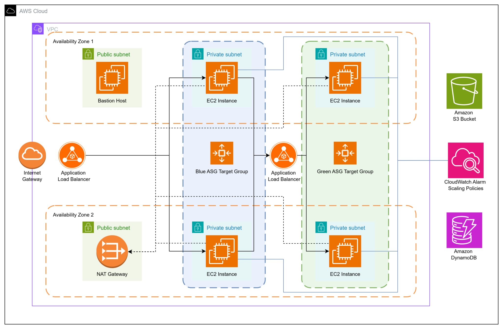

# AWS Multi-Tier Infrastructure with Terraform

## 📖 Overview
This project provisions a **highly available, secure, and scalable AWS 3-tier architecture** using **Terraform**. It follows **Infrastructure as Code (IaC)** best practices for cloud infrastructure design, separating frontend, backend, and database state locking. 

### 3-Tier Multi-AZ AWS Architecture


The infrastructure is designed for **3-Tier Architecture**, an example  and includes:
- **Networking** with VPC, public and private subnets, Internet Gateway, and NAT Gateway
- **Compute** with Bastion Host, Auto Scaling Groups (ASG) and Application Load Balancers (ALB)
- **Security** with modular Security Groups and Security Group Rules
- **Storage & State Management** with S3 and DynamoDB
- **Best Practices** such as modular design, tagging, and high availability

---

## Architecture

### Key Components
| Component                        | Details |
|---------------------------------|---------|
| **VPC**                         | `10.0.0.0/16` CIDR |
| **Public Subnets**              | `10.0.1.0/24` (AZ1), `10.0.2.0/24` (AZ2) |
| **Private Subnets**             | `10.0.3.0/24` to `10.0.6.0/24` |
| **Internet Gateway**            | Enables public internet access |
| **NAT Gateway**                 | Allows private subnets to reach the internet |
| **EC2 Bastion Host**            | Secure SSH access to private resources |
| **Frontend & Backend ASGs**     | Scalable application servers |
| **Application Load Balancers**  | Public ALB (frontend) and internal ALB (backend) |
| **S3 + DynamoDB**               | Terraform state and locking |
| **Security Groups**             | Fine-grained ingress and egress rules |

---

## Getting Started

### Prerequisites
- Terraform v1.5+
- AWS CLI configured with valid credentials
- An AWS account

### Steps to Deploy for Bucket and DynamoDB
```bash
# Clone the repository
git clone https://github.com/Ramondroid/multi-az-aws-infrastructure.git
cd multi-az-aws-infrastructure

# Create terraform.tfvars and put values according to the variables inside variables.tf

# Initialize Terraform for Bootstrap
cd bootstrap
terraform init

# Preview changes
terraform plan

# Apply changes
terraform apply
```

### Steps to Deploy for Multi-AZ-Infrastructure
```bash

# Create terraform.tfvars and put values according to the variables inside variables.tf
cd ..
cd main

# Initialize Terraform for Main
terraform init

# Preview changes
terraform plan

# Apply changes
terraform apply
```

---

## Key Features
- **High Availability:** Multi-AZ setup for resiliency
- **Scalability:** Auto Scaling Groups with CPU-based scaling policies
- **Security:** Bastion Host and least privilege security groups
- **Cost Optimization:** Modular design, easy resource scaling
- **Automation:** Terraform for reproducible environments

---

## SSH Key Setup

Move your `.pem` file to a secure location and set correct permissions:

```bash
mv ~/your-dir/my-key.pem ~/.ssh/
chmod 400 ~/.ssh/my-key.pem
```

## Accessing Private Instances

Use Agent Forwarding to the Bastion Host using the .pem key. Retrieve the public ip of the Bastion Host and SSH into the Bastion Host

After accessing the Bastion Host by SSH connection, SSH into a private instance from Bastion.

```bash
ssh -t ec2-user@<PRIVATE_INSTANCE_IP>
```

